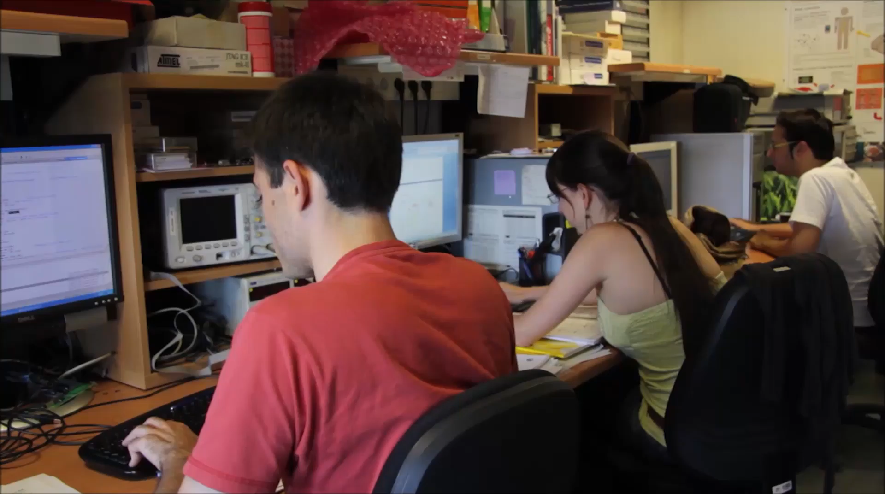
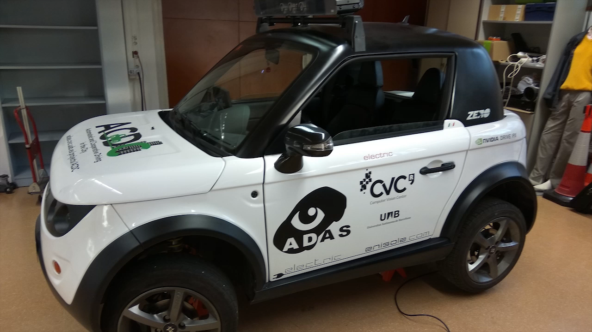
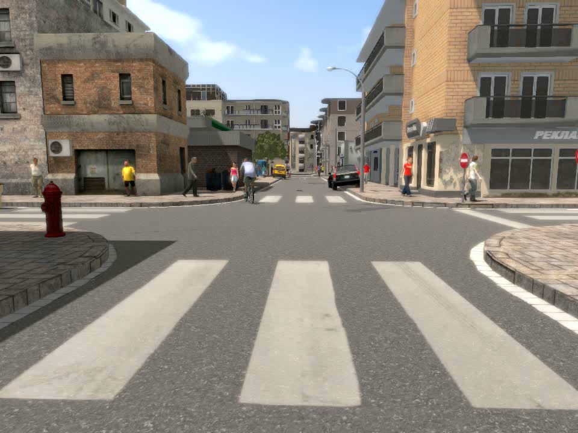
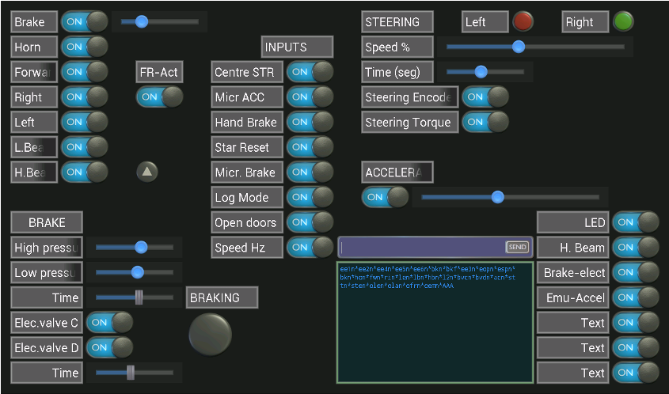
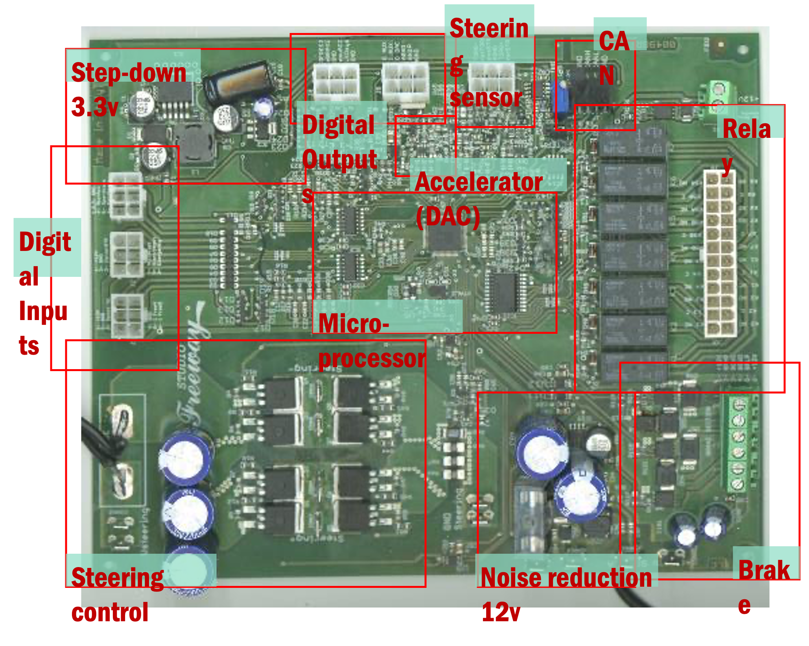

<!-- Video Modal Popup -->

  

    

      <h3 class="video-modal-title" id="video-modal-title">Video</h3>
      <button class="video-modal-close" onclick="closeVideoModal()">✕</button>
    

    

      <iframe id="video-modal-player" src="" frameborder="0" allowfullscreen allow="accelerometer; autoplay; clipboard-write; encrypted-media; gyroscope; picture-in-picture"></iframe>
    

  

<!-- Key Metrics -->

  

    
20+

    
Top-tier Publications

  

  

    
3

    
Universities

  

  

    
400 FPS

    
Real-time Stixel

  

  

    
2010s

    
Active Period

  

---

## Autonomous Driving in Action

The Elektra platform demonstrates **real-world autonomous capabilities** — from perception-to-control integration across urban driving scenarios. Watch the full autonomous driving demonstration:

<button class="featured-video-btn" onclick="openVideoModal('tvZnN65jbCE', 'On-Road Autonomous Driving Demo')">▶ Watch Full Autonomous Driving Demo</button>

---

## Project Overview

**Elektra** is an autonomous driving platform positioned as the **Catalan hub of autonomous driving**, bringing together more than **20 professionals** from diverse backgrounds across academia and industry.

  

**A Multidisciplinary Ecosystem:**
- **CVC-UAB** — Environment perception & computer vision
- **CAOS-UAB** — Embedded hardware & GPU optimization
- **UPC-Tarrasa** — Control & path planning
- **CTTC-UPC** — Positioning & localization
- **UAB-DEIC** — Vehicle-to-vehicle communications
- **UAB-CEPHIS** — Electronics & integration
- **CT Ingenieros** — Vehicle engineering & drive-by-wire
- **Municipality of Sant Quirze** — Test track facility

**Project Goals:**
Elektra serves as a **research and technology transfer hub** for intelligent mobility, combining cutting-edge academic research with real-world validation. The platform integrates multiple discipline areas—perception, planning, control, communications—to demonstrate production-ready autonomous driving in urban environments.

**Core Focus:**
The project heavily relies on **computer vision techniques** for high-level perception tasks (stereo vision, stixels, obstacle detection, scene understanding) while addressing the full stack: localization (GPS + IMU + vision), navigation (planning and control), and communications.

  

  

    

      

        

          
        

        

          
        

        

          <button class="slideshow-dot active" onclick="currentSlide(1, 'project')"></button>
          <button class="slideshow-dot" onclick="currentSlide(2, 'project')"></button>
        

        
Elektra autonomous vehicle platform

      

    

  

  <h4>Related Videos</h4>
  

    

      
      
Project Overview

    

    

      
      
Driving Demo

    

    

      
      
Person Detection

    

  

---

## Computer Vision Center (CVC)

  

The **Computer Vision Center (CVC)** is a non-profit research institution founded in 1995 by the Generalitat de Catalunya and Universitat Autònoma de Barcelona. It has positioned itself as a reference in computer vision research through:

**Core Activities:**
- **Forming students** in Computer Vision, Machine Learning, AI, Real-time Systems, GPU Computing, and Autonomous Control
- **Basic research** producing high-impact papers in top-tier conferences and Q1 journals
- **Technological transfer & innovation** developing prototypes and products with industry partners
- **Dissemination** bringing research applications to the general public

The Elektra project exemplifies this mission—a **research platform with real-world impact** that drives both academic excellence and industry collaboration.

  

  

    

      

        

          
        

        

          <button class="slideshow-dot active" onclick="currentSlide(1, 'cvc')"></button>
        

        
CVC Research Facility

      

    

  

  <h4>Related Videos</h4>
  

    

      
      
CVC Overview

    

    

      
      
Research Activities

    

  

---

## Perception System Design

  

I **initiated and led the perception system development**, designing the full pipeline from raw sensor data to high-level scene understanding: object detection, semantic segmentation, 3D reconstruction, and SLAM.

The system integrates **multiple modalities** for robust environmental understanding:
- **Stereo cameras** for dense 3D reconstruction
- **Monocular vision** for long-range detection
- **LIDAR** for precise 3D mapping and obstacle detection
- **Inertial sensors** for motion estimation
- **Real-time GPU processing** for production-scale performance

**Key achievements:**
- Developed real-time 3D scene understanding pipelines
- Integrated multiple perception modalities for redundancy and accuracy
- Optimized GPU processing for embedded automotive hardware

  

  

    

      

        

          
        

        

          
        

        

          <button class="slideshow-dot active" onclick="currentSlide(1, 'perception')"></button>
          <button class="slideshow-dot" onclick="currentSlide(2, 'perception')"></button>
        

        
Real-time stereo vision processing

      

    

  

  <h4>Related Videos</h4>
  

    

      
      
Perception System

    

    

      
      
Stixels

    

    

      
      
Real-time Processing

    

    

      
      
Sensor Integration

    

    

      
      
Vision Pipeline

    

    

      
      
GPU Processing

    

    

      
      
Embedded Systems

    

  

---

## Obstacle & Pedestrian Detection

  

**Accurate pedestrian and obstacle detection** is the first critical capability for safe autonomous driving. The system must identify all potential hazards in real-time, from dynamic pedestrians to static obstacles.

**Detection capabilities:**
- **Real-time pedestrian detection** using convolutional neural networks
- **Multi-scale object detection** for obstacles at various distances
- **Temporal consistency** across frames to reduce false positives
- **Confidence scoring** for risk-aware planning decisions

**Key innovations:**
- GPU-accelerated detection pipelines (400+ FPS)
- Robust detection in diverse lighting and weather conditions
- Integration with planning for collision avoidance

The detection system feeds directly into the motion planning module, ensuring the vehicle can react to dynamic scenes in real-time.

  

  

    

      

        

          
        

        

          <button class="slideshow-dot active" onclick="currentSlide(1, 'obstacle')"></button>
        

        
Real-time pedestrian detection visualization

      

    

  

  <h4>Related Videos</h4>
  

    

      
      
Obstacle Detection

    

    

      
      
Pedestrian Detection

    

    

      
      
Real-time Detection

    

    

      
      
Safety Systems

    

  

---

## Free Space & Lane Detection

  

**Free space and lane detection** identifies drivable areas and lane boundaries, forming the second critical capability for safe navigation. The system distinguishes between obstacles and navigable space, and maintains lane awareness.

**Key components:**
- **Stixel representation** for efficient 3D scene geometry
- **Lane boundary detection** using road markings and structure
- **Drivable space segmentation** accounting for obstacles and curbs
- **Real-time processing** at full frame rate

**Technical approach:**
- Dense stereo processing for 3D depth
- Dynamic programming for optimal path detection
- Adaptive thresholding for varying road conditions
- Integration with localization for global path coherence

The free space representation enables the planning module to compute safe trajectories that avoid obstacles while staying within lane boundaries.

  

  

    

      

        

          
        

        

          <button class="slideshow-dot active" onclick="currentSlide(1, 'freespace')"></button>
        

        
Free-space detection highlighting drivable areas

      

    

  

  <h4>Related Videos</h4>
  

    

      
      
Free Space Detection

    

    

      
      
Lane Detection

    

    

      
      
Navigation Processing

    

    

      
      
Road Understanding

    

    

      
      
Drivable Space

    

  

---

## SYNTHIA: Synthetic Data Innovation

  

**SYNTHIA** is a synthetic data generation framework that creates diverse, photorealistic driving scenarios for training and validation. This addresses the fundamental challenge: collecting large-scale, labeled data for autonomous driving is expensive and time-consuming.

**SYNTHIA capabilities:**
- **Multiple environmental conditions**: day, night, rain, fog, snow
- **Diverse urban scenarios**: intersections, pedestrian crossings, parked vehicles
- **Automatic labeling**: ground truth for semantic segmentation, depth, optical flow
- **Scalable generation**: thousands of labeled frames in hours

**Research impact:**
- Enables training robust perception models
- Provides controlled testing scenarios for algorithm validation
- Reduces dependency on expensive field data collection
- Published at top-tier conferences (CVPR, ICCV, ECCV)

SYNTHIA data powered much of the Elektra perception pipeline, ensuring robustness across diverse real-world conditions.

  

  

    

      

        

          
        

        

          
        

        

          <button class="slideshow-dot active" onclick="currentSlide(1, 'synthia')"></button>
          <button class="slideshow-dot" onclick="currentSlide(2, 'synthia')"></button>
        

        
SYNTHIA daytime urban scenario

      

    

  

  <h4>Related Videos</h4>
  

    

      
      
SYNTHIA Overview

    

    

      
      
Synthetic Data

    

    

      
      
SYNTHIA Training

    

    

      
      
Data Labeling

    

    

      
      
Rendering Engine

    

    

      
      
Urban Scenarios

    

  

---

## Localization & Positioning

  

**Accurate localization** is critical—the vehicle must know its precise position relative to global maps and local obstacles. Elektra integrates multiple modalities for robust 6-DOF pose estimation.

**Localization approaches:**
- **GPS + IMU fusion** for global positioning with inertial smoothing
- **Visual odometry** from stereo cameras for local motion estimation
- **Loop closure detection** to correct drift over long distances
- **Semantic SLAM** leveraging detected landmarks

**Key challenges addressed:**
- GPS denial in urban canyons (bridges, tunnels)
- Sensor drift accumulation over long drives
- Real-time processing constraints for embedded hardware
- Robustness to dynamic scenes and moving objects

The localization module feeds global coordinates to the planning system, enabling precise navigation to destinations while integrating with local perception for immediate obstacle avoidance.

  

  

    

      

        

          
        

        

          <button class="slideshow-dot active" onclick="currentSlide(1, 'localization')"></button>
        

        
GPS and vision-based localization

      

    

  

  <h4>Related Videos</h4>
  

    

      
      
Localization

    

    

      
      
SLAM

    

    

      
      
GPS Integration

    

    

      
      
Map Matching

    

    

      
      
Sensor Fusion

    

    

      
      
Position Estimation

    

  

---

## Path Planning & Navigation

  

**Motion planning** computes smooth, collision-free trajectories from the vehicle's current position to its destination. The planner integrates global route planning with local obstacle avoidance.

**Planning stack:**
- **Global planning** using road networks and maps to compute coarse routes
- **Local planning** generating smooth trajectories that respect vehicle dynamics
- **Trajectory optimization** minimizing time, fuel, and passenger comfort metrics
- **Reachability analysis** ensuring planned motions are executable by the vehicle

**Key innovations:**
- Real-time dynamic replanning as obstacles and goals change
- Integration with free-space and localization modules
- Consideration of vehicle kinematic constraints
- Safety-critical validation for automated motion

The planning module outputs reference trajectories that feed into the low-level vehicle control system, ensuring the vehicle executes safe, comfortable driving behaviors.

  

  

    

      

        

          
        

        

          <button class="slideshow-dot active" onclick="currentSlide(1, 'planning')"></button>
        

        
Path planning and trajectory visualization

      

    

  

  <h4>Related Videos</h4>
  

    

      
      
Path Planning

    

    

      
      
Navigation

    

    

      
      
Trajectory Optimization

    

    

      
      
Route Planning

    

    

      
      
Obstacle Avoidance

    

    

      
      
Dynamic Planning

    

    

      
      
Behavior Planning

    

    

      
      
Motion Strategies

    

  

---

## Vehicle Control & Execution

  

**Low-level vehicle control** executes the planned trajectories by commanding steering, acceleration, and braking. This module transforms high-level motion plans into real-time actuator commands.

**Control architecture:**
- **Trajectory tracking control** maintaining planned position and velocity
- **Steering control** with constraints on maximum steering angle and rate
- **Longitudinal control** (acceleration/braking) respecting vehicle dynamics
- **Actuator interfacing** with drive-by-wire systems

**Technical highlights:**
- PID-based and model predictive control approaches
- Real-time embedded implementation on vehicle hardware
- Safety monitors detecting control failures
- Graceful degradation modes for fault tolerance

The control module is the final link in the autonomous driving chain, transforming software decisions into physical vehicle motion while ensuring safety and passenger comfort.

  

  

    

      

        

          
        

        

          
        

        

          <button class="slideshow-dot active" onclick="currentSlide(1, 'control')"></button>
          <button class="slideshow-dot" onclick="currentSlide(2, 'control')"></button>
        

        
Low-level motion control

      

    

  

  <h4>Related Videos</h4>
  

    

      
      
Vehicle Control

    

    

      
      
Drive-by-Wire

    

    

      
      
Control Demo

    

    

      
      
Steering Control

    

    

      
      
Speed Control

    

    

      
      
Safety Systems

    

    

      
      
Hardware Integration

    

    

      
      
Testing Procedures

    

    

      
      
Real-world Validation

    

  

---

## Test Track & Controlled Environment

**Real-world validation** at the Sant Quirze test track and urban environments was essential for proving the integrated system. Controlled testing grounds allowed for systematic evaluation before public road operation.

**Testing program:**
- **Structured scenarios** with known obstacles and traffic patterns
- **Sensor characterization** under diverse weather and lighting conditions
- **Safety case building** documenting system reliability and failure modes
- **Public demonstrations** showcasing autonomous capabilities

The test track served as the primary venue for validating each subsystem—perception, planning, and control—both in isolation and as an integrated autonomous driving platform.

---

## Partnerships & Collaborators

The **multidisciplinary nature** of Elektra required collaboration across academic institutions and industry partners:

- **Universitat Autònoma de Barcelona (UAB)** — CVC (perception), CAOS (hardware), DEIC (communications), CEPHIS (electronics)
- **Universitat Politècnica de Catalunya (UPC)** — Tarrasa (control & planning), CTTC (positioning)
- **CT Ingenieros** — Vehicle engineering and drive-by-wire integration
- **Municipality of Sant Quirze** — Test track facility and urban testing permissions

This consortium model enabled knowledge transfer, technology validation, and real-world deployment—positioning Elektra as a complete autonomous driving platform rather than isolated research components.

---

## Key Publications

The Elektra project generated more than **20 peer-reviewed publications** at top-tier conferences and journals, including:

- **CVPR, ICCV, ECCV** — Computer vision and perception
- **IEEE TITS** — Intelligent transportation systems
- **IEEE T-IV** — Intelligent vehicles
- **Robotics and Autonomous Systems** — System integration and control

Key contributions include stixel-based 3D scene understanding, synthetic data generation (SYNTHIA), semantic segmentation for autonomous driving, and real-time perception system design.

---

## Legacy & Impact

**Elektra has left a lasting mark on autonomous driving research:**

- **Proof of concept** that vision-centric autonomous driving is achievable
- **Benchmark datasets** enabling community-wide algorithm comparison
- **Technology transfer** to industry and other research groups
- **Student training** producing graduates who advanced the field

The platform demonstrated that **accurate perception, robust planning, and reliable control** together enable urban autonomous driving—a paradigm that continues to influence modern autonomous vehicle development today.
