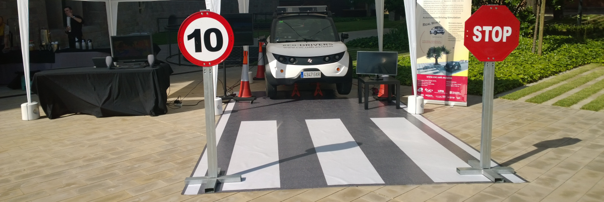
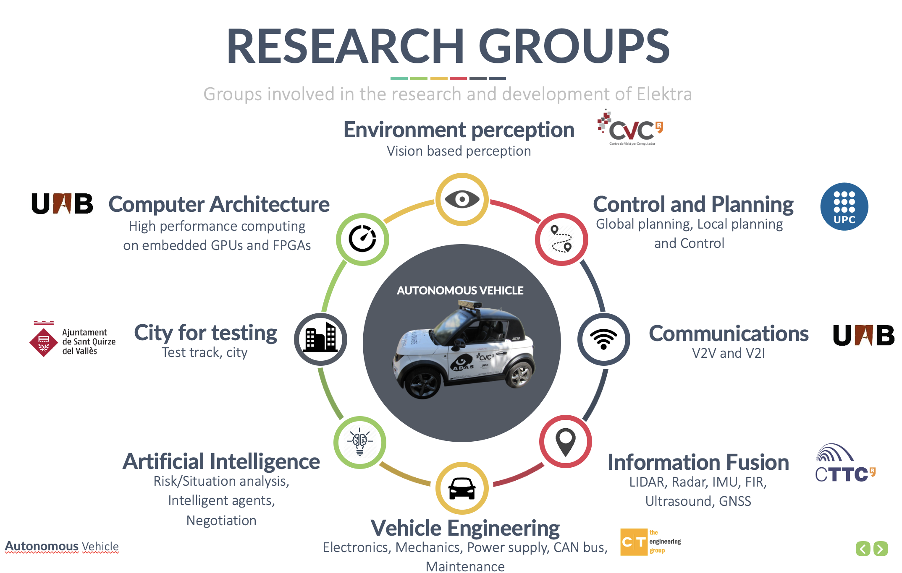
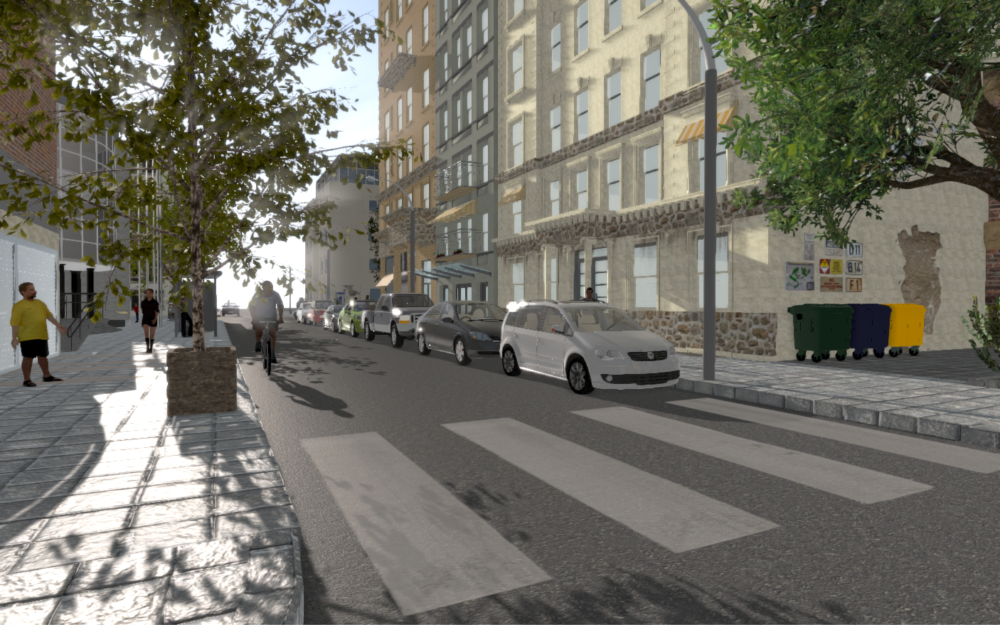
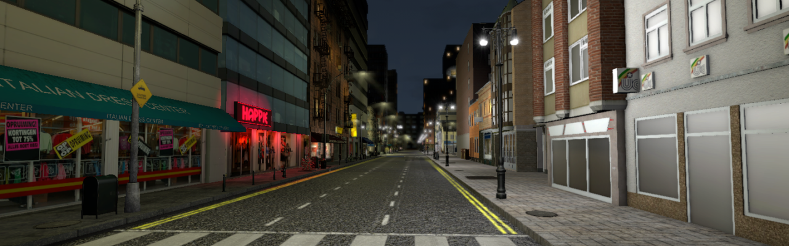
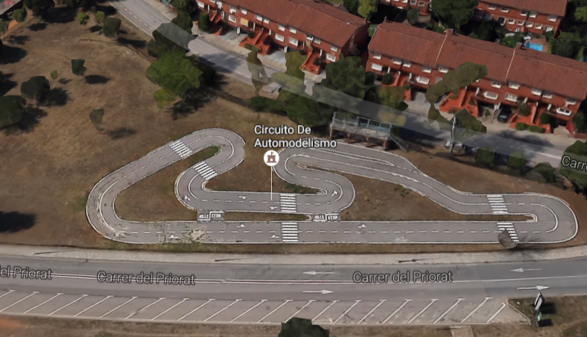
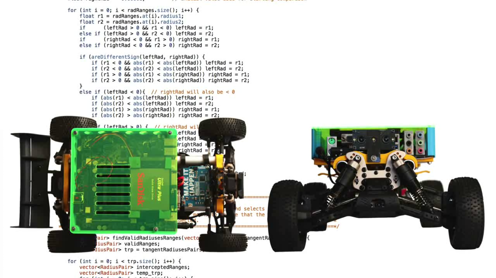
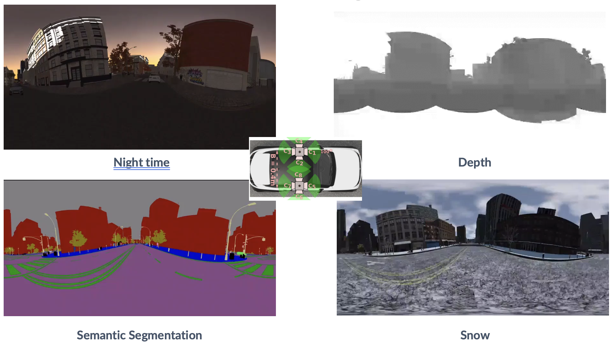
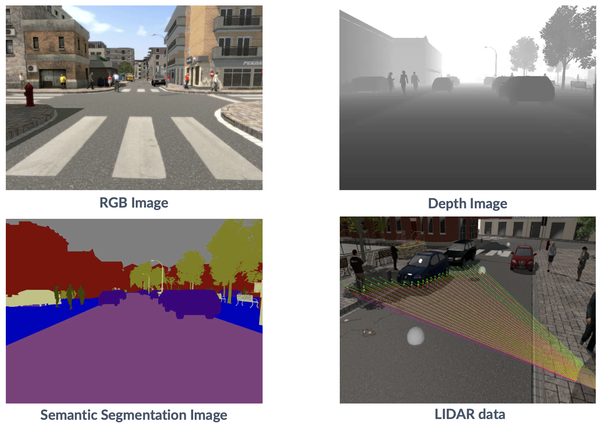

  

    

      <h3 class="video-modal-title" id="video-modal-title">Video</h3>
      <button class="video-modal-close" onclick="closeVideoModal()">✕</button>
    

    

      <iframe id="video-modal-player" src="" frameborder="0" allowfullscreen allow="accelerometer; autoplay; clipboard-write; encrypted-media; gyroscope; picture-in-picture"></iframe>
    

  

  

20+

Top-tier Publications

  

8

Partner Institutions

  

400 FPS

Real-time Stixel

  

2010s

Active Period

---

## Autonomous Driving in Action

Watch the Elektra platform navigate urban roads autonomously — perception, planning, and control integrated end-to-end:

<button class="featured-video-btn" onclick="openVideoModal('tvZnN65jbCE', 'On-Road Autonomous Driving Demo')">▶ Watch Autonomous Driving Demo</button>

---

## Project Overview

**Elektra** is an autonomous driving platform and the **Catalan hub of autonomous driving**, bringing together more than **20 professionals** from academia and industry. The platform integrates perception, planning, control, and communications to demonstrate production-ready autonomous driving in urban environments.

  

**Partner institutions:**
- **CVC-UAB** — Environment perception & computer vision
- **CAOS-UAB** — Embedded hardware & GPU optimization
- **UPC-Tarrasa** — Control & path planning
- **CTTC-UPC** — Positioning & localization
- **UAB-DEIC** — Vehicle-to-vehicle communications
- **UAB-CEPHIS** — Electronics & integration
- **CT Ingenieros** — Vehicle engineering & drive-by-wire
- **Municipality of Sant Quirze** — Test track facility

The **Computer Vision Center (CVC)** led the perception stack — my primary contribution to the project. Validation was performed at the Sant Quirze test track and in urban environments, demonstrating the system across controlled and real-world scenarios.

  

  

    

      

        

          
        

        

          
        

        

          <button class="slideshow-dot active" onclick="currentSlide(1, 'project')"></button>
          <button class="slideshow-dot" onclick="currentSlide(2, 'project')"></button>
        

        
Elektra autonomous vehicle platform

      

    

  

---

## Perception System

I **initiated and led the full perception pipeline** — from raw sensor data to high-level scene understanding. The system fuses multiple modalities for robust environmental awareness:

  

**Obstacle & Pedestrian Detection**
Real-time CNN-based detection running at 400+ FPS on GPU hardware, with multi-scale detection for obstacles at various distances and temporal consistency across frames.

**Free Space & Lane Detection**
Stixel-based 3D scene representation identifies drivable areas and lane boundaries from dense stereo depth. Adaptive thresholding handles varying road conditions in real time.

**3D Reconstruction & SLAM**
Stereo cameras provide dense depth estimation. Visual odometry and loop closure detection enable robust 6-DOF localization even in GPS-denied environments (tunnels, urban canyons).

**Sensor Fusion**
Stereo cameras, monocular vision, LIDAR, and IMU are combined for redundant, accurate scene understanding optimized for embedded automotive hardware.

  

  

    

      

        

          
        

        

          
        

        

          
        

        

          
        

        

          <button class="slideshow-dot active" onclick="currentSlide(1, 'perception')"></button>
          <button class="slideshow-dot" onclick="currentSlide(2, 'perception')"></button>
          <button class="slideshow-dot" onclick="currentSlide(3, 'perception')"></button>
          <button class="slideshow-dot" onclick="currentSlide(4, 'perception')"></button>
        

        
Real-time stereo vision processing

      

    

  

---

## SYNTHIA: Synthetic Data for Autonomous Driving

**SYNTHIA** is a synthetic data generation framework I developed within the Elektra project that creates photorealistic, automatically labeled driving scenarios — addressing the fundamental bottleneck of acquiring large-scale annotated driving data.

  

**Capabilities:**
- Multiple environmental conditions: day, night, rain, fog, snow
- Diverse urban scenes: intersections, pedestrian crossings, parked vehicles
- Automatic ground-truth labels for semantic segmentation, depth, and optical flow
- Scalable: thousands of labeled frames in hours

**Impact:**
SYNTHIA powered the Elektra perception pipeline, reducing the need for expensive field data collection and enabling systematic testing across conditions that are rare or dangerous to capture in the real world. Results were published at CVPR, ICCV, and ECCV. The dataset was licensed to Intel, Audi, and Huawei.

  

  

    

      

        

          
        

        

          
        

        

          <button class="slideshow-dot active" onclick="currentSlide(1, 'synthia')"></button>
          <button class="slideshow-dot" onclick="currentSlide(2, 'synthia')"></button>
        

        
SYNTHIA daytime urban scenario

      

    

  

---

## Publications & Impact

The Elektra project generated **20+ peer-reviewed publications** at top venues including CVPR, ICCV, ECCV, IEEE TITS, and IEEE T-IV. Key contributions include:

- **Stixel-based 3D scene understanding** — efficient real-time scene representation
- **SYNTHIA dataset** — synthetic data for autonomous driving, widely used in the community
- **Semantic segmentation** pipelines for urban scene understanding
- **Domain adaptation** methods bridging synthetic and real data

**Legacy:** Elektra proved vision-centric autonomous driving is achievable in real urban conditions and produced benchmark datasets still used by the research community. Alumni of the team now work at leading autonomous driving companies worldwide.

---

## Selected Videos

  <button class="video-link-btn" onclick="openVideoModal('tvZnN65jbCE', 'Autonomous Driving Demo')">▶ Autonomous Driving Demo</button>
  <button class="video-link-btn" onclick="openVideoModal('FWM-5Ps8zFo', 'Elektra Project Overview')">▶ Project Overview</button>
  <button class="video-link-btn" onclick="openVideoModal('7u-mMtm1Q9o', 'Person Detection')">▶ Person Detection</button>

